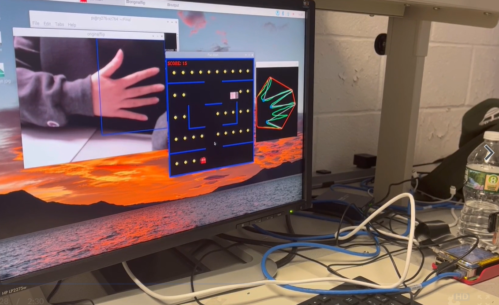

# Pac-Man-with-Gestures
This is the final project for ECE5725 at Cornell University.
Collaboration between Rufei Ye and Xianmin Zhao.

In the project, we expanded the classic Pac-Man game with gesture controls. 

The design replaces the original keyboard operation with hand movements to control the direction of Pac-Man's movement. The four gestures correspond to the four directions of up, down, left and right. In  the  first  step, a Pac-Man game was designed with pygame. It has three levels: learning, easy level and hard level. Next, to complete the real-time gesture recognition part, PiCamera, computer vision and OpenCV are used. Finally, the game module and the gesture recognition module were connected through specific command files in linux( Raspberry Pi).

 

| GESTURES | UP | DOWN | LEFT | RIGHT |
| ------ | ------ | ------ |------ | ------ |
| FINGERS | 2 | 3 | 5 | 4 |

 

